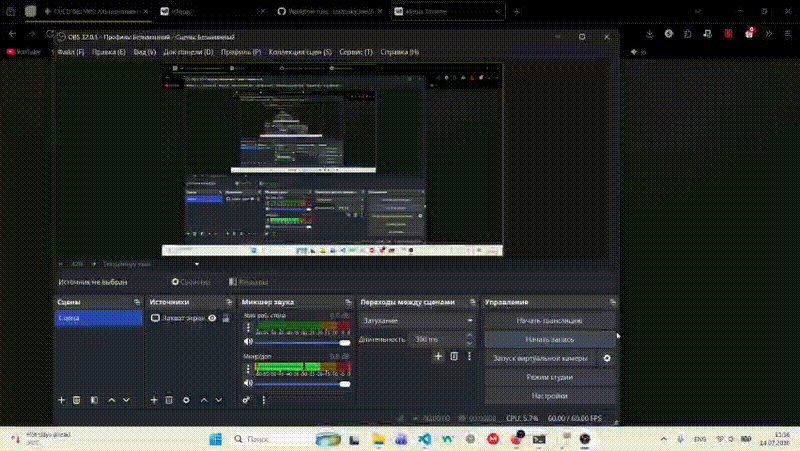

```markdown
# AudioTrimmer


Высокопроизводительный веб-инструмент для точной обрезки и обработки аудиофайлов прямо в браузере. Построен на базе Next.js 16 (App Router), React 19 и Tailwind CSS v4 в структуре pnpm-монорепозитория с настроенным Docker-деплоем.

---

## 🎬 Демонстрация


---

## 🚀 Основные возможности

* 🎵 **Точная обрезка аудио:** Визуальное редактирование таймлайна с точностью до миллисекунд.
* ⚡ **Клиентская обработка:** Быстрая работа с Web Audio API без нагрузки на серверную часть.
* 🎨 **Современный UI:** Минималистичный тёмный интерфейс на базе Tailwind CSS v4 и Lucide Icons.
* 📦 **Монорепозиторий:** Удобное управление структурой и зависимостями через `pnpm-workspace`.
* 🐳 **Контейнеризация:** Готовые конфигурации Docker / Docker Compose для изолированного запуска.
* 🔄 **Автоматический CI/CD:** Бесшовный деплой на VPS через GitHub Actions при пуше в `main` или `dev`.

---

## 🛠 Технологический стек

* **Frontend:** Next.js 16 (App Router, Turbopack), React 19, TypeScript
* **Стилизация:** Tailwind CSS v4, Lucide React, clsx
* **Менеджер пакетов:** `pnpm` v11 (`pnpm-workspace`)
* **Инфраструктура:** Docker, Docker Compose, Nginx
* **CI/CD:** GitHub Actions + SSH Deployment

---

## 📂 Структура проекта

```text
AudioTrimmer/
├── docs/                 # Демонстрационные материалы
│   └── demo.gif
├── frontend/             # Основное Next.js приложение
│   ├── src/
│   ├── public/
│   └── next.config.mjs
├── docker-compose.yml    # Конфигурация запуска контейнеров
├── Dockerfile
├── pnpm-workspace.yaml   # Конфигурация pnpm workspace
└── README.md

```



---

## 💻 Локальный запуск

### Требования

* Node.js >= 20.x
* pnpm >= 10.x

### Инструкция по установке

1. **Клонируй репозиторий:**
```bash
git clone git@github.com:IzzatulloOne/AudioTrimmer.git
cd AudioTrimmer

```


2. **Установи зависимости:**
```bash
pnpm install

```


3. **Запусти dev-сервер приложения:**
```bash
pnpm --filter frontend dev

```


Приложение будет доступно по адресу: `http://localhost:3000`

---

## 🐳 Запуск через Docker

Для проверки продакшен-сборки локально:

```bash
# Сборка и запуск в фоновом режиме
docker compose up -d --build

# Просмотр логов
docker compose logs -f

```

---

## 🔄 CI/CD Пайплайн

Проект использует автоматический деплой при пуше в ветки `main` и `dev`:

1. GitHub Actions устанавливает SSH-соединение с VPS.
2. Выполняет `git pull` актуальных изменений из нужной ветки.
3. Бесшовно пересобирает Docker-контейнеры (`docker compose up -d --build`).
4. Автоматически очищает старые неиспользуемые контейнеры и образы (`docker image prune -f`).

---

## 👤 Автор

* **GitHub:** [@IzzatulloOne](https://www.google.com/search?q=https://github.com/IzzatulloOne)
